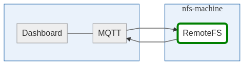

# Architecture

## Purpose
The RemoteFS service allows bucket comand (create, copy, delete) to be executed local to the data. Secondly it reports the size of the storage disk and the size of each bucket.

Design rationale: In the BigBoat Architecture the same NFS directory is mounted on each node. Thus, it would be possible to execute the same file commands on all nodes. 
However, in practice, copying and deleting folders on NFS can take a considerable amount of time if the folder contains a lot of data or small files.
RemoteFS runs on the NFS machine, thus all file operations run local to the data. This way copying and deletion actions are much faster.



RemoteFS subscribes to a couple of topics on which it receives the create, copy and delete commands. Information about the buckets and total storage capacity is published through MQTT as well.

## Features

- Create a new bucket
- Copy the data of an existing bucket to a new bucket
- Delete a bucket
- Report disk space
- Report bucket sizes

## MQTT

### Subscriptions

- /commands/storage/bucket/create

    Publish a message to this topic in order to create a new bucket. Example:
    ```
    {
        name: "my-new-bucket"
    }
    ```

- /commands/storage/bucket/copy

    Publish a message to this topic in order to copy an existing bucket. Example:
    ```
    {
        source: "existing-bucket"
        destination: "copy-of-existing-bucket"
    }
    ```

- /commands/storage/bucket/delete

    Publish a message to this topic in order to remove a bucket. Example:
    ```
    {
        name: "existing-bucket"
    }
    ```

### Publications

- /errors/remotefs
    
    An internal error has occured while performing an operation. Example:
    ```
    {
        action: "get datastore size",
        message: "something when wrong..."
    }
    ```

- /errors/storage
    
    An internal error has occured while performing an operation. Example:
    ```
    {
        action: "get size",
        message: "something when wrong..."
    }
    ```


- /logs/storage

    Emits all actions that are taking place (create, copy, delete). Example:
    ```
    {
        action: "copy bucket"
        message: "Copying bucket1 to bucket2"
    }
    ```

- /agent/storage/buckets
    Reports all storagebuckets. Example:
    ```
    [
        {
            name: 'bucket1',
            created: 8938745087,
            isLocked: false
        },
        {
            name: 'bucket2',
            created: 8393841045,
            isLocked: true
        },
        ...
    ]
    ```

- /agent/storage/bucket/size
    
    Reports the sizes of a storage bucket. Example:
    ```
    {
        name: "bucket1",
        size: 98345
    }
    ```

- /agent/storage/size

    Reports usage of the total storage capacity. Example:
    ```
    {
        name: '/storage/dir/,
        total: 10000,
        used: 2000,
        free: 8000,
        percentage: "20%"
    }
    ```